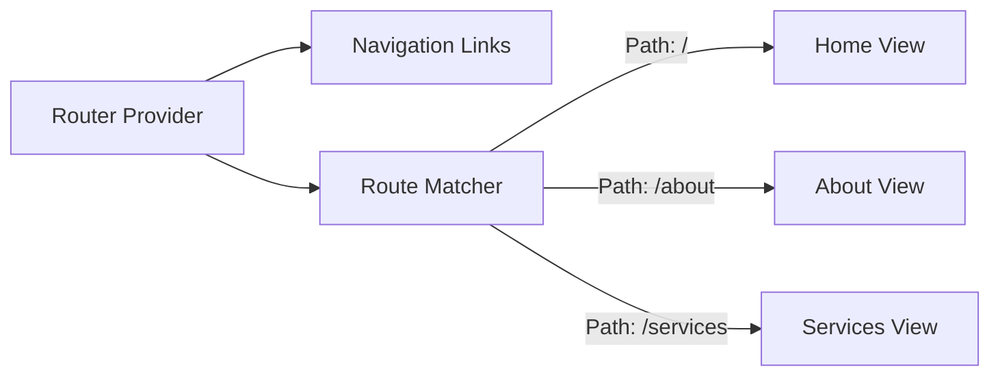

# Experiment 4: Implement Routing in SPA

<div align="center">
  
  
</div>

## Project Overview

This repository contains the codebase for **Implement Routing in SPA**, implemented as part of the College Experiment of Full Stack 2 curriculum. The objective of this experiment is to configure client-side routing, enabling navigation between different functional views without reloading the page.

## Architecture & Data Flow



## Core Components

| Component | Responsibility | Technologies Used |
|-----------|----------------|-------------------|
| `App.tsx` | Router definition, static navigation elements, and route mapping | React Router DOM |
| `App.css` | Layout spacing for navigation menus and view sections | CSS |

## Key Features

- **Declarative Routing**: URL definition mapping directly to React components.
- **Seamless Navigation**: Links intercept standard browser requests to quickly swap views.
- **Persistent Layout**: Header and Footer content persistently surround dynamic router outlets.
- **Organized Views**: Segregated code blocks for discrete page functionality.

## Getting Started

### Prerequisites
- Node.js (v16 or higher)

### Installation
```bash
npm install
npm run dev
```


## Source Code (`App.tsx`)

```tsx
import { BrowserRouter as Router, Routes, Route, Link } from 'react-router-dom';
import './App.css';

const Home = () => (
  <div className="page">
    <h1>Welcome Home</h1>
    <p>This is the landing page of our Single Page Application.</p>
  </div>
);

const About = () => (
  <div className="page">
    <h1>About Us</h1>
    <p>Learn more about our mission and the team behind this project.</p>
  </div>
);

const Services = () => (
  <div className="page">
    <h1>Our Services</h1>
    <p>Discover the range of solutions we offer for modern web development.</p>
  </div>
);

function App() {
  return (
    <Router>
      <div className="app-container">
        <nav className="nav-menu">
          <div className="nav-logo">ROUTING<span>SPA</span></div>
          <div className="nav-links">
            <Link to="/" className="link">Home</Link>
            <Link to="/about" className="link">About</Link>
            <Link to="/services" className="link">Services</Link>
          </div>
        </nav>

        <main className="content">
          <Routes>
            <Route path="/" element={<Home />} />
            <Route path="/about" element={<About />} />
            <Route path="/services" element={<Services />} />
          </Routes>
        </main>

        <footer className="footer">
          <p>© 2026 Routing Experiment. All rights reserved.</p>
        </footer>
      </div>
    </Router>
  );
}

export default App;

```
